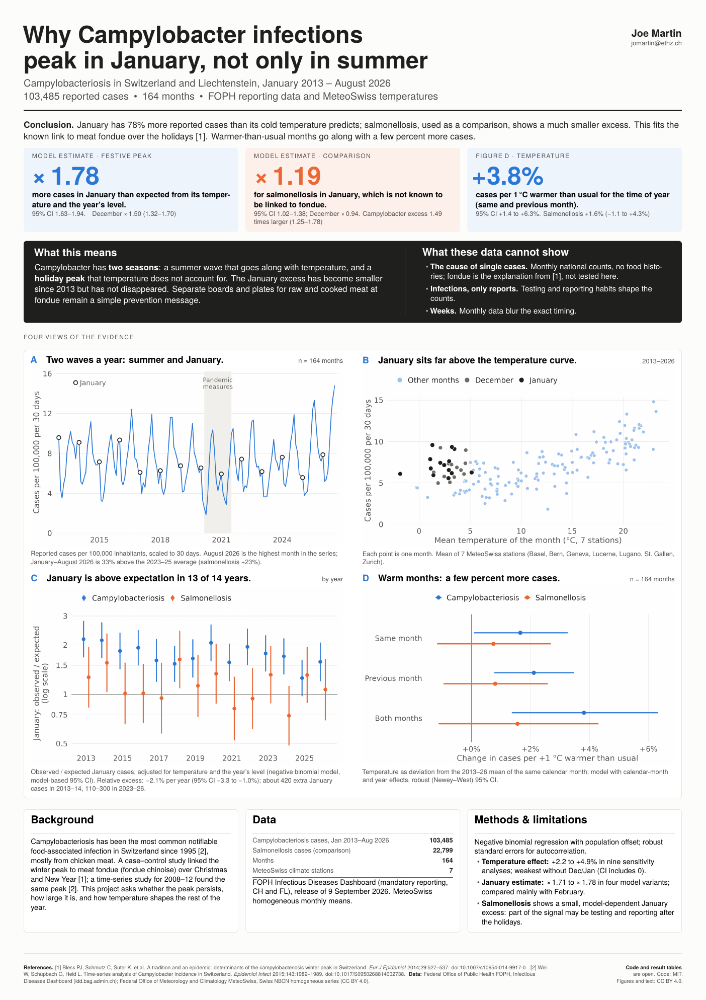
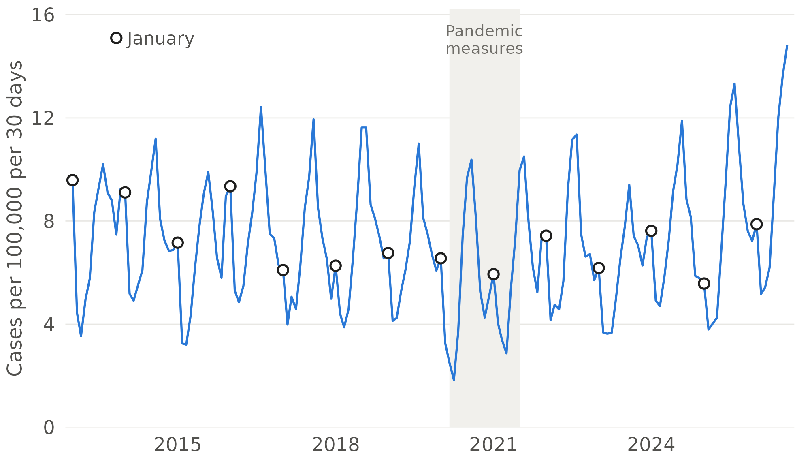
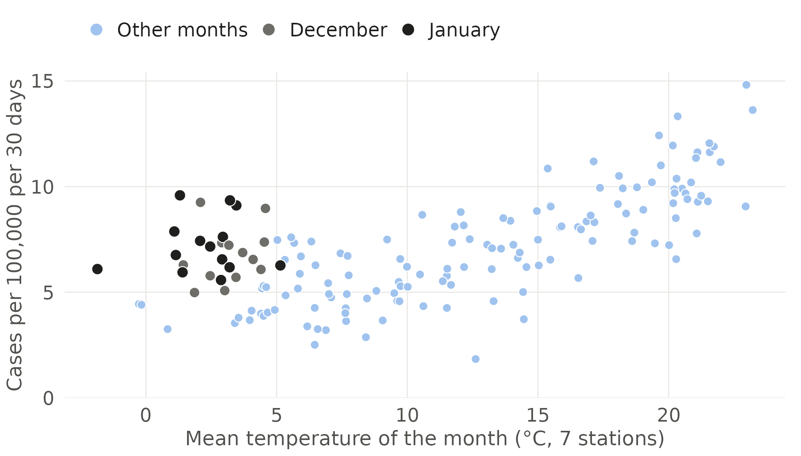
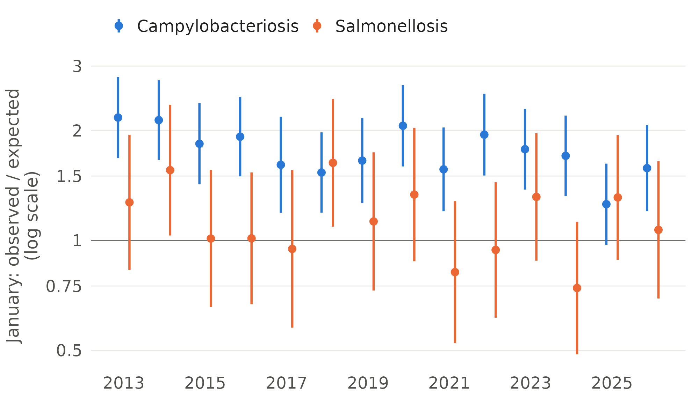
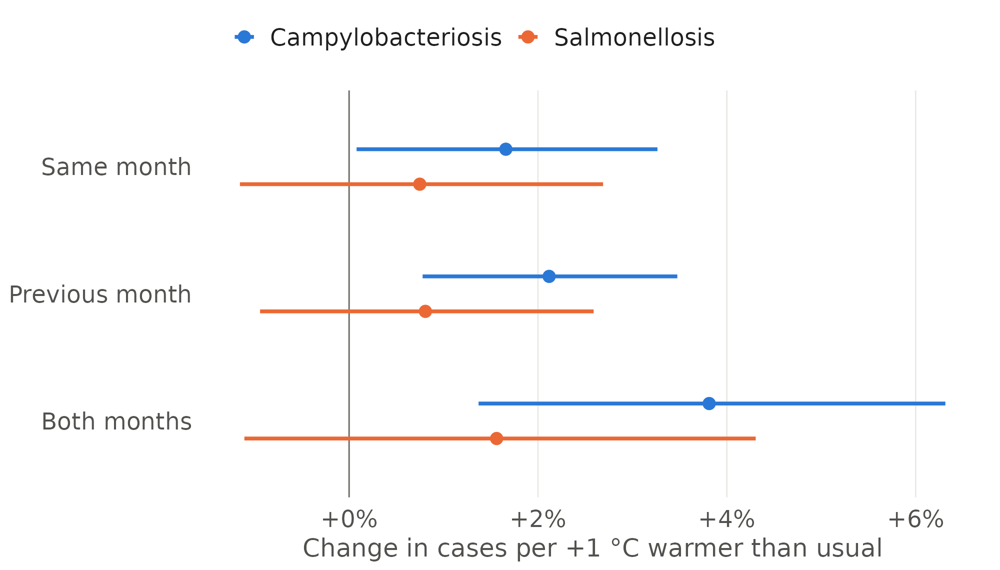

# Why Campylobacter infections peak in January, not only in summer

**Campylobacteriosis in Switzerland and Liechtenstein, January 2013 – August 2026: the festive winter peak and the effect of temperature**

Joe Martin · BSc Food Science & Technology, ETH Zurich · jomartin@ethz.ch



---

## Summary

Campylobacteriosis has been the most common notifiable food-associated infection in Switzerland since 1995 [2], mostly acquired from chicken meat. Reported cases rise in summer, but there is also a second peak around Christmas and New Year. A case–control study linked this winter peak to meat fondue (*fondue chinoise*) [1], and a time-series analysis for 2008–2012 described the same pattern [2].

This project uses the public monthly reporting data of the Federal Office of Public Health (FOPH/BAG) and homogeneous temperature series from MeteoSwiss to ask three questions for 2013–2026:

1. **How strongly are case numbers associated with temperature**, beyond the normal seasonal cycle? (files `q1_*`)
2. **How large is the January (and December) excess**, once temperature and the overall level of each year are taken into account? Is it specific to *Campylobacter*? Has it changed over time? (files `q2_*`)
3. **How does 2026 compare with earlier years?** (files `q3_*`)

Salmonellosis serves as a comparison (negative control): it is also food-borne and reported through the same system, but it is not known to be associated with meat fondue.

## Findings

- **January has 78% more reported campylobacteriosis cases than expected** from its temperature and the year's level (rate ratio 1.78, 95% CI 1.63–1.94). December is also elevated (1.50, 1.32–1.70). Across four model variants the January estimate lies between 1.71 and 1.78. Because January and December have their own indicators, the comparison is in practice with the other cold months, mostly February.
- **The excess is much smaller for salmonellosis**: January 1.19 (1.02–1.38), December 0.94 (0.82–1.07). The January excess is 1.49 times larger for *Campylobacter* than for *Salmonella* (1.25–1.78); for December 1.60 (1.33–1.92). The salmonellosis estimates depend on the model (January 1.02 to 1.24 across variants). A small January excess in both diseases suggests that part of the January signal may come from testing or reporting after the holidays, for example tests from late December being counted in January.
- **In every year from 2013 to 2026 the January estimate for *Campylobacter* is above 1** (13 of 14 with a confidence interval above 1; 2025: 1.26, 0.97–1.62). The *relative* excess has declined by about 2.1% per year (95% CI −3.3 to −1.0%), from roughly ×2.1 in 2013–14 to ×1.3–1.7 in 2024–26. In absolute terms, the excess fell from about 420 extra January cases in 2013–14 to 110–300 in 2023–26. Single years vary (2020 and 2022 were near ×2), so the trend should not be over-read. For salmonellosis there is no clear trend.
- **Warmer-than-usual months are associated with slightly more cases.** Per 1 °C above the usual temperature for the time of year (in the same and the previous month), reported campylobacteriosis increases by 3.8% (95% CI +1.4 to +6.3%). The effect is split between the same month (+1.7%) and the previous month (+2.1%). For salmonellosis the estimate is +1.6% (−1.1 to +4.3%). The campylobacteriosis estimate stays between +2.2% and +4.9% in nine sensitivity analyses; it is weakest when December and January are left out (+2.2%, −0.2 to +4.7%), so part of the signal comes from winter months, where the holiday peak could interfere.
- **2026 is a high year.** August 2026 is the highest month in the series, and January–August 2026 incidence is 33% above the 2023–25 average (salmonellosis +23%). These months were 0.95 °C warmer than in 2023–25; as a rough illustration only (the model estimates short-term deviations, not differences between years), the temperature association would correspond to about +4% of the +33%. August 2026 may still rise with late reports.

**What this means.** *Campylobacter* has two seasons: a summer wave that goes along with temperature, and a holiday peak that temperature does not account for. The festive peak has become smaller in relative terms but has not disappeared, which supports continued prevention messages (separate plates and boards for raw and cooked meat at fondue). The analysis uses monthly national counts and therefore cannot show what caused individual cases; the fondue explanation comes from the earlier case–control study [1] and is consistent with, but not tested by, these data.

---

## Figures

| | |
|---|---|
|  |  |
| **A** Monthly incidence 2013–2026, January marked | **B** Incidence against temperature; January and December far above the curve |
|  |  |
| **C** January excess by year, *Campylobacter* vs *Salmonella* | **D** Change in cases per +1 °C warmer than usual |

---

## Data

| Source | Content | Licence / terms |
|---|---|---|
| FOPH/BAG, Infectious Diseases Dashboard (IDD), export API `CAMPYLOBACTERIOSIS_oblig`, `SALMONELLOSIS_oblig` | Cases from the mandatory reporting system, Switzerland and Liechtenstein, monthly, national (January 2013 – August 2026); population used by FOPH | Public data; free use with source attribution (Epidemics Act Art. 9, Swiss OGD strategy) |
| MeteoSwiss, Swiss National Basic Climatological Network (NBCN), homogeneous monthly series | Monthly mean air temperature (`ths200m0`) and precipitation (`rhs150m0`) for 7 stations: Basel/Binningen, Bern/Zollikofen, Genève/Cointrin, Lugano, Luzern, St. Gallen, Zürich/Fluntern | CC BY 4.0 |

FOPH data release: 9 September 2026 (data up to 8 September 2026). MeteoSwiss data downloaded on 25 September 2026. The raw files are archived in `data/raw/` with SHA-256 checksums in `results/input_manifest.csv`. The monthly FOPH counts add up exactly to the published annual totals (`results/check_monthly_vs_annual.csv`).

**What the counts are.** Reported cases. Only people who see a doctor and are tested appear in the data, so the counts depend on care-seeking, testing and reporting. The export does not document whether a case is assigned to a month by date of test, diagnosis or report.

---

## Methods

All models are negative binomial regressions of monthly case counts with an offset for population × days in the month (R, `MASS::glm.nb`). Standard errors are Newey–West heteroskedasticity- and autocorrelation-consistent estimates (lag 3 months, `sandwich`), because neighbouring months are correlated.

**Temperature (Q1).** Temperature is expressed as the *anomaly*: the monthly mean of the 7 stations minus the 2013–2026 mean of the same calendar month. The model includes calendar-month effects (the seasonal cycle), year effects (long-term level, pandemic years) and the anomaly in the same and the previous month:

`cases ~ calendar month + year + anomaly(t) + anomaly(t−1) + offset(log(population × days))`

The temperature effect is therefore estimated only from months that were warmer or colder than usual for the time of year, not from the seasonal cycle itself.

**Festive peak (Q2).** Here the seasonal cycle is described through temperature (natural splines with 3 df for the same and the previous month) plus year effects, and indicators for January and December measure how far these months lie above what their temperature and year predict. Variants: one added sine/cosine harmonic; pandemic months (March 2020 – June 2021) excluded; splines with 5 df. The spline's cold end is estimated mainly from February and a few cold Novembers and Marches. The January excess by year uses one indicator per January (model-based standard errors, since each indicator rests on a single month); these intervals ignore residual autocorrelation and are likely somewhat too narrow. The trend uses a January × year interaction (robust SE). The *Campylobacter*/*Salmonella* ratio combines the two separate estimates on the log scale, treating them as independent; shared reporting effects would correlate them positively, so this is probably conservative. The Newey–West estimator treats the negative binomial dispersion parameter as fixed.

**Sensitivity analyses for the temperature effect** (`results/q1_temperature_sensitivity.csv`): model-based instead of robust standard errors; quasi-Poisson; pandemic months excluded; December and January excluded; Zürich station only; adjusted for precipitation anomaly; complete years only; smooth time trend instead of year effects; adjusted for the previous month's incidence.

---

## Results tables

**Festive peak** (rate ratio, 95% CI; temperature splines + year model)

| | January | December |
|---|---|---|
| Campylobacteriosis | 1.78 (1.63–1.94) | 1.50 (1.32–1.70) |
| Salmonellosis | 1.19 (1.02–1.38) | 0.94 (0.82–1.07) |
| Ratio Campylobacter / Salmonella | 1.49 (1.25–1.78) | 1.60 (1.33–1.92) |

**Temperature** (change in cases per +1 °C above the usual temperature)

| | Same month | Previous month | Both months |
|---|---|---|---|
| Campylobacteriosis | +1.7% (+0.1 to +3.3) | +2.1% (+0.8 to +3.5) | +3.8% (+1.4 to +6.3) |
| Salmonellosis | +0.7% (−1.2 to +2.7) | +0.8% (−0.9 to +2.6) | +1.6% (−1.1 to +4.3) |

**Sensitivity of the combined temperature effect for campylobacteriosis:** +2.2% to +4.9% across nine alternative analyses. It is weakest when December and January are excluded (+2.2%, −0.2 to +4.7%) and strongest when the pandemic months are excluded (+4.9%, +2.9 to +6.8%).

**Annual incidence** (cases per 100,000): campylobacteriosis 69–96 per year (lowest 2020, highest 2025); salmonellosis rose from 15.5 (2013) to 25.2 (2025). Full tables: `results/q3_annual_incidence.csv`, `results/q3_jan_aug_by_year.csv`.

---

## Limitations

- **Monthly national data.** Weekly or regional counts would pin down the timing of the holiday peak more exactly; the public export offers only monthly national figures (cantonal data are annual).
- **Reported cases, not infections.** Changes in testing (for example wider use of multiplex PCR panels for diarrhoea) or reporting can change counts without a change in infections. This may contribute to the recent increase in both diseases; the data here cannot separate these explanations.
- **Temperature is a proxy.** The 7-station mean is unweighted and stands for exposure pathways (food handling, contact with animals and water, outdoor activities) that were not measured.
- **Residual autocorrelation.** Pearson residuals of the temperature model are correlated from month to month (lag-1 correlation 0.43), which is why robust standard errors and an autoregressive sensitivity model are reported.
- **Salmonellosis is an imperfect control.** It shows a small January excess of its own, so the negative control is informative but not clean.
- **Population.** FOPH uses the same population figure for 2024 and 2025 (9,091,915) and a slightly different one for 2026 (9,091,674); population data for these years are not yet final.
- **Recent months** may still be revised upward by late reports, although FOPH marks all months used as complete (`dataComplete`).
- **Timing of reports.** The export does not say whether a month refers to the date of test, diagnosis or report; holiday testing delays could shift cases from December into January.
- **Climatology.** The anomaly baseline uses 14 years for January–August and 13 for September–December; the calendar-month effects absorb this.

---

## Reproducibility

```
├── R/Campy_Analysis.R         # full analysis: data checks, models, sensitivity analyses, figures
├── scripts/download_data.sh   # re-downloads the raw data from FOPH and MeteoSwiss
├── data/raw/                  # archived raw data (September 2026)
├── results/                   # all result tables (CSV), input checksums, R session info
├── figures/                   # poster figures (PNG)
├── poster/                    # A1 poster (XeLaTeX source, PDF, PNG)
└── fonts/                     # TeX Gyre Heros (free Helvetica clone), GUST Font License
```

1. `Rscript R/Campy_Analysis.R` from the repository root (a few seconds; packages: data.table, MASS, splines, sandwich, ggplot2, patchwork, scales).
2. Poster: `cd poster && xelatex Poster_Campylobacter_CH_A1.tex` (twice).
3. Optional: `bash scripts/download_data.sh` for the latest data. FOPH replaces its export every month, so newer data give slightly different numbers.

R and package versions are in `results/session_info.txt`.

---

## References

1. Bless PJ, Schmutz C, Suter K, Jost M, Hattendorf J, Mäusezahl-Feuz M, Mäusezahl D. A tradition and an epidemic: determinants of the campylobacteriosis winter peak in Switzerland. *European Journal of Epidemiology* 2014;29:527–537. [doi:10.1007/s10654-014-9917-0](https://doi.org/10.1007/s10654-014-9917-0)
2. Wei W, Schüpbach G, Held L. Time-series analysis of *Campylobacter* incidence in Switzerland. *Epidemiology and Infection* 2015;143:1982–1989. [doi:10.1017/S0950268814002738](https://doi.org/10.1017/S0950268814002738)
3. Federal Office of Public Health FOPH. Infectious Diseases Dashboard, data and API. [idd.bag.admin.ch](https://www.idd.bag.admin.ch/en/portal-data)
4. MeteoSwiss. Swiss National Basic Climatological Network, homogeneous data series. [data.geo.admin.ch](https://data.geo.admin.ch/browser/index.html#/collections/ch.meteoschweiz.ogd-nbcn)

---

## Authorship

Research question, analysis decisions and interpretation: Joe Martin. Code, poster layout and text were drafted with the help of an AI assistant (Claude, Anthropic) and checked, revised and run by the author. All numbers come from the scripts in this repository.

## Licence

- **Code** (`R/`, `scripts/`): MIT, see `LICENSE`.
- **Figures, poster, text and result tables**: CC BY 4.0.
- **Data**: case counts © Federal Office of Public Health FOPH, Infectious Diseases Dashboard (IDD); temperature and precipitation © MeteoSwiss, CC BY 4.0. Redistributed unchanged in `data/raw/` with attribution.
- **Fonts**: TeX Gyre Heros, GUST Font License (`fonts/GUST-FONT-LICENSE.txt`).
